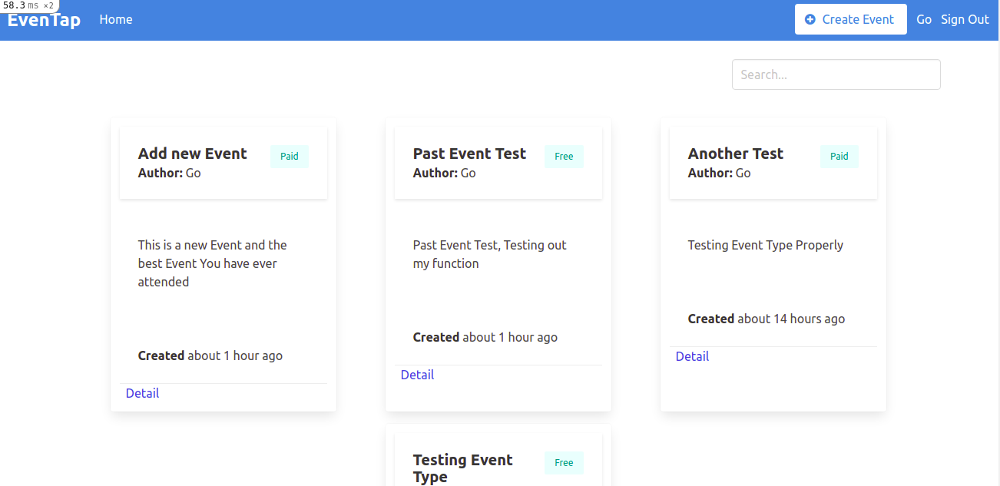

# EvenTap 
### Tix.Africa Challenge
Our (DIY) event ticketing platform — tix.africa — allows users to create an event and go live (selling paid or free tickets) in under five minutes. Using Ruby on Rails (or equivalent MVC framework), build a basic MVP of an events application, using only traditional CRUD methods.
The system allows user to authenticate and create, read update and Delete an Event.


## Screenshot :camera:


## Built With :heart:

- Ruby v2.7.0
- Ruby on Rails v5.2.4
- SQlite - Postgres 12.0
- Bulma

## Live Demo :rocket:
 [PostSpot]()

## Work Done :computer:
- The user logs in to the app, only by typing the email and password, after sign up
- The landing page is list of all event created by current user and other users.
- The List displays the Event name, Event Type(Paid or Free), little description of the Event.
- When the user clicks on details it goes to the show page.
- The Event show page shows detail description of the event as entered by the Creator/Author
- The user can only delete Event that was created by him/her

## Getting Started 

To get a local copy up and running follow these simple example steps.
- Fork the repository on github
- Change directory into the repository
- Install all gems using bundle Install
- Create Database
- Run migration


### Prerequisites

- Ruby: 2.6.3
- Rails: 5.2.3
- Postgres: >=9.5


## Setting up Postgres
Read this to set up [postgres](https://www.calhoun.io/how-to-install-postgresql-9-5-on-ubuntu-16-04/) for development
or simply start project with 
<code> rails new app_name --database=postgresql </code>

### Setup :wrench:

Instal gems with:

```
bundle install
```

Setup database with:

To configure your databse.yml make this changes in config/database.yml

```
   default: &default
    adapter: postgresql 
    encoding: unicode 
    timeout: 5000 

    development: <<: *default 
    database: development 
    
    test: <<: *default 
    database: test

    production: <<: *default 
    database: production
```
Then run
```
   yarn install --chack-files
   rails db:create
   rails db:migrate
```
    Start server with:
```
    rails server
```

### Test 
 ```
    rails spec
 ```
## Set up Repo for testing
- How to setup – RSpec, Capybara, Shoulda-Matchers, Database Cleaner
- How to create a factory using Factory Girl Rails and Faker, you you can [read more](https://www.sitepoint.com/learn-the-first-best-practices-for-rails-and-rspec/) for details

### Usage

Start server with:

```
    rails server
```

Open `http://localhost:3000/` in your browser.

### Run tests

```
    rpsec --format documentation
```

### Deployment

 Heroku

## ✒️ Author

👤 **Haroon Abdulrazaq**

- Github: [@Haroonabdulrazaq](https://github.com/Haroonabdulrazaq)
- Twitter: [@Hanq_o](https://twitter.com/Hanq_o)
- Linkedin: [Haroonabdulrazaq](https://www.linkedin.com/in/haroon-abdulrazaq/)


## 🤝 Contributing

Contributions, issues and feature requests are welcome!

Feel free to check the fork this repo and create pull request if you want to make changes.

## Show your support :muscle:

Give a ⭐️ if you like this project!

## MIT Licence :registered:

MIT License

Copyright (c) 2020 Haroon Abdulrazaq

Permission is hereby granted, free of charge, to any person obtaining a copy
of this software and associated documentation files (the "Software"), to deal
in the Software without restriction, including without limitation the rights
to use, copy, modify, merge, publish, distribute, sublicense, and/or sell
copies of the Software, and to permit persons to whom the Software is
furnished to do so.